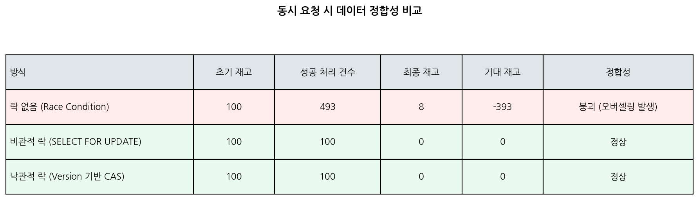
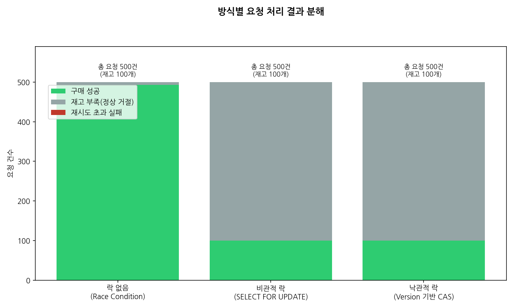
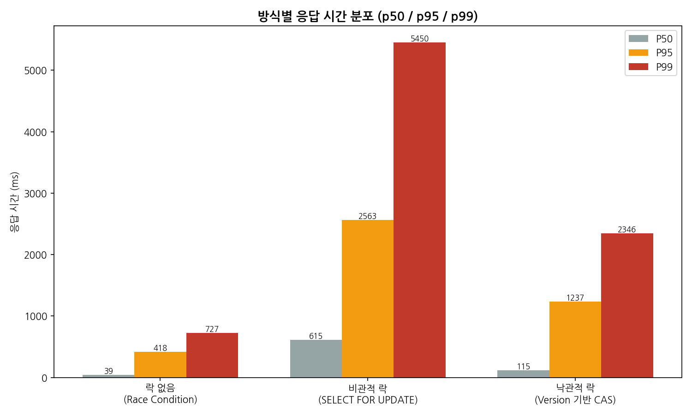
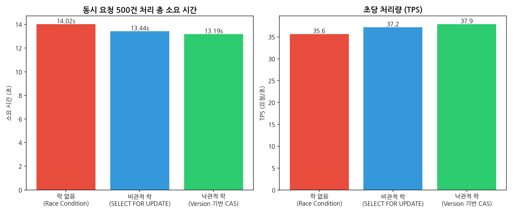

# 선착순 타임세일 & 재고 차감 API — 비관적 락 vs 낙관적 락 동시성 제어 비교

같은 "재고 차감" 로직을 **락 없음 / 비관적 락 / 낙관적 락** 세 가지 방식으로 각각 구현하고,
동시에 수백 명이 몰리는 상황을 시뮬레이션해서 정합성 과 응답 속도가
방식에 따라 어떻게 달라지는지 정량적으로 비교한 프로젝트입니다.

> 완성도 높은 서비스를 만드는 것이 아니라, "동시성 제어를 이해하고 있는가"를
> 재현 가능한 실험과 수치로 증명하는 것을 목표로 만들었습니다.

---

## 1. 왜 이 실험을 했는가

타임세일이나 선착순 이벤트에서 재고를 차감하는 로직은 겉보기엔 단순하지만,
"재고를 읽고 → 남았는지 확인하고 → 1개 차감해서 저장한다"는 세 단계 사이에
동시에 다른 요청이 끼어들면 실제 재고보다 더 많이 팔리는 오버셀링 버그가 발생합니다.

이 프로젝트는 그 버그를 의도적으로 재현하고, 이를 해결하는 두 가지 대표적인 방법인
비관적 락(Pessimistic Lock) 과 낙관적 락(Optimistic Lock) 을 직접 구현해
어떤 트레이드오프가 있는지 실험으로 보여줍니다.

---

## 2. 세 가지 방식 구현 개념

### (A) 락 없음
재고를 읽고, 확인하고, 차감해서 저장하는 세 단계 사이에 아무 보호장치가 없습니다.
동시에 여러 요청이 같은 재고 값을 읽으면 **Lost Update(갱신 손실)** 가 발생해
실제로 판 것보다 재고가 덜 줄어들거나, 재고보다 훨씬 많은 주문이 "성공" 처리됩니다.

### (B) 비관적 락
해당 상품 행을 먼저 잠근 트랜잭션이 끝날 때까지 다른 트랜잭션은 대기합니다.
정합성은 확실히 보장되지만, 경쟁이 심할수록 락 대기 시간이 늘어 응답 속도가 느려지고
편차(p99)가 커지는 트레이드오프가 있습니다.
(SQLite는 `FOR UPDATE` 문법이 없어 `BEGIN IMMEDIATE`로 유사하게 재현했습니다 — 5번 항목 참고)

### (C) 낙관적 락
락을 걸지 않고 진행하되, `UPDATE ... WHERE version = 읽었던_버전` 조건으로
내가 읽은 이후 다른 트랜잭션이 먼저 수정했는지 확인합니다. 조건이 어긋나면(다른 트랜잭션이
먼저 반영) 재조회 후 재시도합니다. 경쟁이 과하지 않으면 락 대기가 없어 빠르지만,
경쟁이 심해질수록 재시도 비용이 늘어납니다.

---

## 3. 실험 결과

**조건: 재고 100개 / 동시 요청 500건 (SQLite, 단일 프로세스)**

### 3-1. 데이터 정합성 비교

| 방식 | 성공 처리 건수 | 최종 재고 | 기대 재고 | 정합성 |
|---|---|---|---|---|
| 락 없음 | **493건** | 8 | -393 | ❌ **붕괴 (오버셀링)** |
| 비관적 락 | 100건 | 0 | 0 | ✅ 정상 |
| 낙관적 락 | 100건 (재시도 111회) | 0 | 0 | ✅ 정상 |

재고가 100개뿐인데 **493건이 "구매 성공" 응답을 받는** 심각한 오버셀링이 재현됐습니다.
실제 서비스에서 이런 버그가 터지면 고객에게 판매 확정 통보 후 취소해야 하는 사고로 이어집니다.

### 3-2. 요청 처리 결과 분해

비관적/낙관적 락은 정확히 재고만큼(100건)만 성공 처리하고 나머지 400건은 "재고 부족"으로
정상 거절합니다. 락 없음은 이 경계 자체가 무너집니다.

### 3-3. 응답 시간 분포 (p50 / p95 / p99)

| 방식 | p50 | p95 | p99 |
|---|---|---|---|
| 락 없음 | 39ms | 418ms | 727ms |
| 비관적 락 | 615ms | 2,563ms | **5,450ms** |
| 낙관적 락 | 115ms | 1,237ms | 2,346ms |

이 그래프가 이 실험의 핵심입니다. **정합성을 지킬수록 응답 시간 비용이 커지고**,
같은 정합성을 지키더라도 **락 대기(비관적) vs 재시도(낙관적)** 방식에 따라
꼬리 지연(p99)이 최대 2배 이상 차이 납니다. 경쟁이 심한 구간에서는 낙관적 락이
평균적으로 더 빠르지만, 재시도 초과로 실패할 가능성도 존재합니다(`RETRY_EXHAUSTED`).

### 3-4. 전체 처리 시간 & TPS

원본 실험 데이터는 [`results/raw_results.json`](results/raw_results.json)에 있습니다.

---

## 8. 구현하며 배운 점

- **SQLite의 단일 Writer 제약**: 초기 구현에서는 "재고 갱신"과 "주문 로그 기록"을
  별도 커밋으로 나눠서 처리했는데, 요청당 락 획득이 2회씩 발생해 500건 동시 요청 시
  타임아웃이 발생했습니다. 두 작업을 하나의 트랜잭션/커밋으로 묶어 요청당 락 획득을
  1회로 줄이자 문제가 해결됐고, 이 과정에서 "논리적으로 원자적이어야 하는 작업은
  실제로도 하나의 트랜잭션으로 묶어야 한다"는 것을 체감했습니다.
- **비관적 락의 SQLite 한계**: 실제 서비스라면 PostgreSQL/MySQL의
  행 단위 락 대비 불필요하게 대기 시간이 늘어날 수 있습니다. 이 프로젝트에서는 "설치 없이
  누구나 바로 실행 가능"을 우선했지만, 실무에서는 MySQL 적용이 필요하다고 생각합니다.
- **낙관적 락의 재시도 전략**: 재시도 횟수에 제한을 두지 않으면
  경쟁이 극심할 때 요청이 영영 끝나지 않을 수 있어, 상한 초과 시 명시적으로
  `RETRY_EXHAUSTED` 상태로 실패 처리하도록 설계했습니다.

---